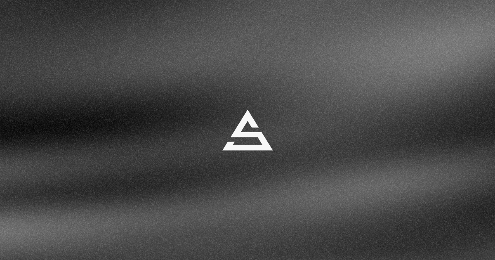

# DevLab — Tutorials 

> Source code for every tutorial from the [**Alvaro DevLabs**](https://www.youtube.com/@AlvaroDevLabs) YouTube channel.

This monorepo collects the demos and starter code that accompany the videos — each one a self-contained, runnable project so you can clone, tinker, and follow along.

▶️ **Subscribe:** [youtube.com/@AlvaroDevLabs](https://www.youtube.com/@AlvaroDevLabs)

## Structure

It's a [pnpm workspace](https://pnpm.io/workspaces). Every tutorial lives under `demos/*` as an independent package:

```
devlab/
├── demos/
│   └── intro-tsl/      # Intro to Three.js Shading Language (TSL)
└── pnpm-workspace.yaml
```

| Demo | Description | Video |
| --- | --- | --- |
| [`intro-tsl`](./demos/intro-tsl) | Intro to the Three.js Shading Language (TSL) | [Watch on YouTube](https://youtu.be/dlrVCxsq1tE) |

> New demos are added as new tutorials ship. ⭐ the repo to keep up.

## Getting started

Requires [pnpm](https://pnpm.io/) and Node.js.

```bash
# Install dependencies for the whole workspace
pnpm install

# Run a specific demo
pnpm -F intro-tsl dev
```

Or just `cd` into the demo you want and run it directly:

```bash
cd demos/intro-tsl
pnpm dev
```

Each demo has its own `README.md` with specific instructions.

## Support 💚

If these tutorials help you, you can support the channel and this work:

- [Become a Sponsor on GitHub](https://github.com/sponsors/alvarosabu)
- [One-time donation via PayPal](https://paypal.me/alvarosaburido)

## License

[MIT](./demos/intro-tsl/LICENSE) © [Alvaro Saburido](https://alvarosaburido.dev)
